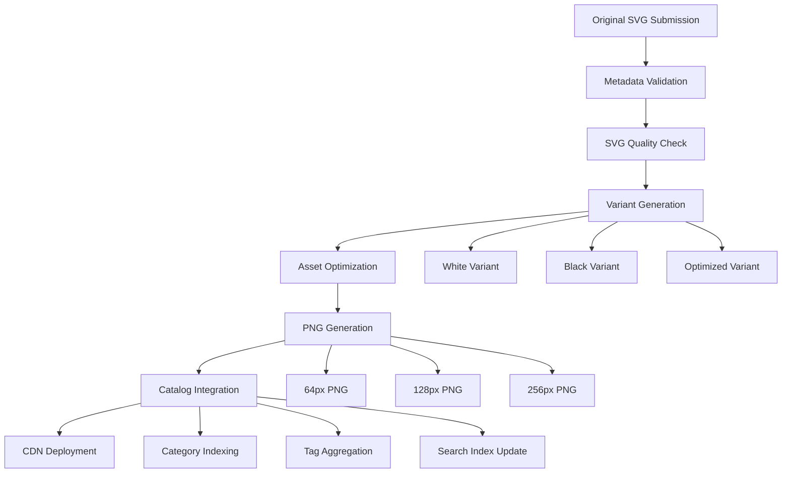

# Contributing to LogoBox

Thank you for your interest in contributing to LogoBox! This document provides comprehensive guidelines for contributing to the project, with a focus on logo submissions and the automated asset processing pipeline.

## Ways to Contribute

- **Submit new logos and icons** - Add high-quality brand logos to our collection
- **Report bugs and issues** - Help us identify and fix problems
- **Suggest new features** - Propose improvements to the platform
- **Improve documentation** - Enhance guides and API documentation
- **Submit code improvements** - Contribute to the codebase
- **Review submissions** - Help validate logo quality and metadata

## Project Structure

```
logobox/
├── assets/                    # Logo assets and metadata
│   ├── logos/                # Individual logo directories
│   └── catalog.json          # Auto-generated master catalog
├── website/                  # Vue.js web application
├── package/                  # NPM package source code
├── scripts/                  # Asset processing and build scripts
│   ├── generateLogoVariants.js  # Creates white/black variants
│   ├── optimizeAssets.js        # Optimizes SVGs and generates PNGs
│   ├── buildCatalog.js          # Builds master catalog
│   └── validateMetadata.js      # Validates metadata files
├── tests/                    # Comprehensive test suites
└── docs/                     # Documentation and guidelines
```

## Logo Submission Guidelines

### Requirements Overview

LogoBox uses an automated asset processing pipeline that transforms your single high-quality SVG submission into multiple optimized variants. Understanding this process is crucial for successful contributions.

#### Core Requirements

1. **High Quality SVG**: Submit only high-quality, official brand SVG files
2. **Legal Rights**: You must have explicit permission to distribute the logo
3. **Complete Metadata**: Provide comprehensive metadata following our schema
4. **Naming Conventions**: Follow strict kebab-case naming for consistency
5. **Quality Standards**: Meet our technical and visual quality requirements

### Automated Asset Processing Pipeline

When you submit a logo, our automated system performs the following operations:

#### 1. Variant Generation (`generateLogoVariants.js`)
- **White Variant**: Automatically converts all fill colors to white (#FFFFFF)
- **Black Variant**: Automatically converts all fill colors to black (#000000)
- **Optimized Variant**: Creates an optimized version using SVGO

#### 2. Asset Optimization (`optimizeAssets.js`)
- **SVG Optimization**: Reduces file size while maintaining quality
- **PNG Generation**: Creates PNG variants in multiple sizes (64px, 128px, 256px)
- **Compression**: Applies optimal compression settings
- **CDN Preparation**: Prepares assets for global CDN distribution

#### 3. Catalog Integration (`buildCatalog.js`)
- **Metadata Aggregation**: Combines all logo metadata into master catalog
- **Category Indexing**: Builds searchable category and tag indexes
- **URL Generation**: Creates CDN URLs for all variants
- **Checksum Calculation**: Generates file integrity checksums

#### 4. Quality Validation (`validateMetadata.js`)
- **Schema Validation**: Ensures metadata follows required structure
- **File Verification**: Confirms all required files are present
- **Category Validation**: Checks categories against approved list
- **Custom Rules**: Applies additional quality checks

### Step-by-Step Submission Process

#### 1. Preparation Phase
```bash
# Fork and clone the repository
git clone https://github.com/your-username/logobox.git
cd logobox

# Install dependencies
npm install

# Create feature branch
git checkout -b add-company-name-logo
```

#### 2. Logo Directory Setup
Create a new directory following our naming convention:
```bash
mkdir assets/logos/company-name
cd assets/logos/company-name
```

#### 3. File Addition
Add the required files:
- `logo.svg` - Your high-quality original SVG
- `metadata.json` - Complete metadata following our schema

#### 4. Local Validation
Run our validation tools before submitting:
```bash
# Validate metadata schema
npm run validate:metadata company-name

# Test variant generation
npm run generate:variants company-name

# Run complete validation suite
npm run validate:logo company-name
```

#### 5. Quality Verification
Verify your submission meets quality standards:
```bash
# Check file sizes and optimization
npm run optimize:logo company-name

# Test catalog integration
npm run build:catalog

# Run comprehensive tests
npm test
```

#### 6. Pull Request Submission
```bash
# Commit your changes
git add assets/logos/company-name/
git commit -m "feat: add Company Name logo"

# Push to your fork
git push origin add-company-name-logo

# Create pull request with detailed description
```

### Directory Structure and File Lifecycle

#### Initial Submission (What You Provide)
```
assets/logos/company-name/
├── logo.svg          # High-quality original SVG (REQUIRED)
└── metadata.json     # Complete metadata (REQUIRED)
```

#### After Processing Pipeline (Auto-Generated)
```
assets/logos/company-name/
├── logo.svg              # Your original file
├── logo-white.svg        # Auto-generated white variant
├── logo-black.svg        # Auto-generated black variant
├── logo-optimized.svg    # Auto-generated optimized variant
├── metadata.json         # Your metadata file
└── png/                  # Auto-generated PNG variants
    ├── 64.png           # 64x64 PNG
    ├── 128.png          # 128x128 PNG
    └── 256.png          # 256x256 PNG
```

### Metadata Schema and Requirements

#### Complete Metadata Template
```json
{
  "name": "Company Name",
  "slug": "company-name",
  "description": "Brief description of the company/product (optional but recommended)",
  "categories": ["technology", "software"],
  "tags": ["programming", "development", "tools", "javascript"],
  "license": "MIT",
  "website": "https://company.com"
}
```

#### Field Specifications

| Field | Type | Required | Description | Validation |
|-------|------|----------|-------------|------------|
| `name` | string | ✅ | Official company/brand name | 1-100 characters |
| `slug` | string | ✅ | URL-safe identifier | kebab-case, 1-50 chars, must match directory |
| `description` | string | ❌ | Brief company description | Max 500 characters |
| `categories` | array | ✅ | Primary categories | 1-5 items from approved list |
| `tags` | array | ✅ | Searchable keywords | Max 10 items, kebab-case |
| `license` | string | ✅ | License type | From approved list |
| `website` | string | ❌ | Official website URL | Valid URI format |

#### Approved Categories
- `technology` - Tech companies and platforms
- `social` - Social media and networking
- `finance` - Financial services and fintech
- `development` - Developer tools and services
- `design` - Design tools and creative software
- `productivity` - Productivity and workflow tools
- `entertainment` - Media and entertainment
- `education` - Educational platforms and tools
- `business` - Business services and enterprise

#### License Types
- `MIT` - MIT License
- `Apache-2.0` - Apache License 2.0
- `GPL-3.0` - GNU General Public License v3.0
- `BSD-3-Clause` - BSD 3-Clause License
- `CC0-1.0` - Creative Commons Zero
- `Custom` - Custom license (specify in description)
- `Unknown` - License unknown or unclear

## Asset Processing Pipeline Deep Dive

Understanding our automated asset processing pipeline helps ensure your submissions integrate seamlessly with the platform. This pipeline fulfills key system requirements for automatic catalog updates, variant generation, and asset optimization.

### Pipeline Architecture



### System Requirements Fulfillment

This pipeline directly addresses several key system requirements:

- **Requirement 3.1**: Automatic catalog updates when new logos are added
- **Requirement 3.3**: Consistent categorization across all platforms
- **Requirement 8.1**: Automatic generation of white and black variants
- **Requirement 8.4**: Proper formatting and compression of all variants

### Processing Scripts Detailed

#### 1. Variant Generation (`generateLogoVariants.js`)

**Purpose**: Creates color variants from your original SVG (Requirement 8.1)

**Process**:
- Parses SVG DOM structure using JSDOM
- Identifies all fill attributes and style properties
- Creates white variant by replacing fills with `#FFFFFF`
- Creates black variant by replacing fills with `#000000`
- Generates optimized variant using SVGO configuration
- Maintains original proportions and structure
- Preserves viewBox and essential SVG attributes

**Quality Checks**:
- Validates SVG syntax and structure
- Ensures proper viewBox definition
- Verifies scalability across variants
- Maintains visual integrity
- Checks for embedded raster images
- Validates color conversion success

**Error Handling**:
- Graceful failure for malformed SVGs
- Detailed error reporting for debugging
- Rollback capability for failed processing
- Validation of generated variants

#### 2. Asset Optimization (`optimizeAssets.js`)

**Purpose**: Optimizes all assets for production deployment (Requirement 8.4)

**SVG Optimization**:
- Removes unnecessary metadata and comments
- Simplifies paths and shapes using SVGO plugins
- Removes unused definitions and empty elements
- Optimizes attribute order and structure
- Reduces file size by 30-70% typically
- Maintains visual fidelity and scalability

**PNG Generation**:
- Creates raster versions at 64px, 128px, 256px using Sharp
- Uses high-quality rendering from SVG source
- Applies optimal compression settings (configurable)
- Maintains transparency and visual quality
- Generates consistent file naming

**Performance Metrics**:
- Tracks compression ratios for each logo
- Monitors file size reductions across variants
- Reports optimization statistics and build times
- Ensures quality thresholds are met
- Validates output file integrity

**Quality Assurance**:
- Pre and post-optimization size comparison
- Visual integrity verification
- Format compatibility checks
- CDN deployment preparation

#### 3. Catalog Building (`buildCatalog.js`)

**Purpose**: Integrates logos into searchable master catalog (Requirements 3.1, 3.3)

**Process**:
- Scans all logo directories recursively
- Aggregates metadata from all logos
- Builds category and tag indexes for consistent categorization
- Generates CDN URLs for all variants and formats
- Creates file integrity checksums using SHA-256
- Compiles comprehensive catalog.json with statistics
- Updates search indexes for website and npm package

**Automatic Updates** (Requirement 3.1):
- Triggered by CI/CD pipeline on repository changes
- Incremental updates for modified logos only
- Full rebuild for structural changes
- Automatic deployment to CDN and npm package

**Consistent Categorization** (Requirement 3.3):
- Validates categories against approved list
- Ensures tag consistency across platforms
- Maintains hierarchical category structure
- Synchronizes metadata across website and package

**Data Structure**:
```json
{
  "version": "1.0.0",
  "lastUpdated": "2025-01-15T10:30:00Z",
  "logos": [...],
  "categories": ["technology", "social", ...],
  "tags": ["javascript", "framework", ...],
  "stats": {
    "totalLogos": 150,
    "totalCategories": 9,
    "totalTags": 45,
    "buildTime": 1250,
    "processedCount": 148,
    "errorCount": 2
  }
}
```

#### 4. Metadata Validation (`validateMetadata.js`)

**Purpose**: Ensures all submissions meet quality standards and maintain consistency

**Schema Validation**:
- Validates JSON structure against comprehensive schema
- Checks required fields presence (name, slug, categories, tags, license)
- Verifies data types and formats using AJV validator
- Ensures value constraints are met (length limits, patterns)
- Validates optional fields when present

**Custom Validations**:
- Slug matches directory name exactly
- Required SVG files exist (logo.svg minimum)
- Categories are from approved list only
- File sizes within limits (< 50KB for SVG)
- SVG syntax is valid and well-formed
- No duplicate slugs across repository
- License types are from approved list

**Quality Requirements**:
- Metadata completeness scoring
- Brand accuracy verification
- Technical specification compliance
- Accessibility requirements check

**Error Reporting**:
- Detailed error messages with context
- Specific field validation failures
- Actionable suggestions for fixes
- Validation success metrics and reports
- Integration with CI/CD for automated checks

### Quality Assurance Process

#### Automated Quality Gates

1. **File Validation**
   - SVG syntax validation
   - File size limits (< 50KB for original)
   - Required files presence check
   - Metadata schema compliance

2. **Visual Quality Checks**
   - Proper centering and padding
   - Scalability verification
   - Color accuracy maintenance
   - Variant generation success

3. **Integration Testing**
   - Catalog build success
   - CDN URL generation
   - Search index integration
   - Cross-platform compatibility

#### Manual Review Process

1. **Brand Accuracy Review**
   - Official logo verification
   - Brand guideline compliance
   - Color accuracy check
   - Visual quality assessment

2. **Legal Compliance Check**
   - License verification
   - Usage rights confirmation
   - Attribution requirements
   - Trademark compliance

3. **Technical Quality Review**
   - SVG optimization effectiveness
   - Variant generation quality
   - File size optimization
   - Performance impact assessment

## Development Setup

### Prerequisites

- **Node.js 18+** - JavaScript runtime
- **npm or yarn** - Package manager
- **Git** - Version control
- **Sharp** - Image processing (auto-installed)
- **SVGO** - SVG optimization (auto-installed)

### Local Development Environment

```bash
# Clone the repository
git clone https://github.com/logobox/logobox.git
cd logobox

# Install all dependencies
npm install

# Install development tools
npm run setup:dev

# Run development server
npm run dev

# Run asset processing pipeline
npm run process:assets

# Run comprehensive tests
npm test
```

### Development Scripts

```bash
# Asset Processing
npm run generate:variants [logo-slug]    # Generate variants for specific logo
npm run optimize:assets [logo-slug]      # Optimize assets for specific logo
npm run build:catalog                    # Build complete catalog
npm run validate:all                     # Validate all logos and metadata

# Development
npm run dev                              # Start development server
npm run build                            # Build for production
npm run preview                          # Preview production build

# Testing
npm run test                             # Run all tests
npm run test:unit                        # Run unit tests only
npm run test:integration                 # Run integration tests
npm run test:e2e                         # Run end-to-end tests
npm run test:performance                 # Run performance tests

# Quality Assurance
npm run lint                             # Run ESLint
npm run format                           # Format code with Prettier
npm run validate:logos                   # Validate all logo submissions
npm run check:quality                    # Run quality checks
```

### Testing

All contributions must include appropriate tests:

- Unit tests for new functionality
- Integration tests for API changes
- End-to-end tests for UI changes

```bash
# Run all tests
npm test

# Run specific test suite
npm run test:unit
npm run test:integration
npm run test:e2e

# Run tests with coverage
npm run test:coverage
```

## Code Standards

### TypeScript/JavaScript

- Use TypeScript for new code
- Follow ESLint configuration
- Use Prettier for formatting
- Include JSDoc comments for public APIs

### Vue.js Components

- Use Composition API
- Follow Vue.js style guide
- Include proper prop validation
- Write component tests

### CSS/Styling

- Use CSS modules or scoped styles
- Follow BEM methodology
- Ensure responsive design
- Test on multiple browsers

## Logo Guidelines

### Technical Requirements

- **Format**: SVG only for original files
- **Size**: No minimum size, but should be scalable
- **Colors**: Use original brand colors
- **Optimization**: Files will be automatically optimized
- **Variants**: White and black variants are auto-generated

### Quality Standards

- Clean, professional appearance
- Properly centered and sized
- No background colors (transparent)
- Minimal file size
- Valid SVG markup

### Brand Guidelines

- Use official brand logos only
- Respect brand guidelines and usage rules
- Include proper attribution
- Verify licensing permissions

## Pull Request Process

1. **Create Feature Branch**: Create a branch from `main`
   ```bash
   git checkout -b feature/add-company-logo
   ```

2. **Make Changes**: Follow the guidelines above

3. **Test Changes**: Run tests and validation
   ```bash
   npm test
   npm run validate:logos
   ```

4. **Commit Changes**: Use conventional commit messages
   ```bash
   git commit -m "feat: add Company Name logo"
   ```

5. **Push Branch**: Push to your fork
   ```bash
   git push origin feature/add-company-logo
   ```

6. **Create PR**: Open a pull request with:
   - Clear description of changes
   - Screenshots if applicable
   - Test results
   - Checklist completion

### Commit Message Convention

Use conventional commits format:

- `feat:` New features or logo additions
- `fix:` Bug fixes
- `docs:` Documentation changes
- `test:` Test additions or modifications
- `refactor:` Code refactoring
- `style:` Code style changes
- `chore:` Build process or auxiliary tool changes

## Review Process

All pull requests will go through:

1. **Automated Checks**: CI/CD pipeline runs tests and validation
2. **Code Review**: Maintainer reviews code quality and adherence to guidelines  
3. **Logo Review**: For logo submissions, verify quality and licensing
4. **Final Approval**: Maintainer approves and merges

## Community Guidelines

- Be respectful and inclusive
- Provide constructive feedback
- Help others learn and improve
- Follow the code of conduct

## Asset Processing Pipeline Documentation

### Complete Pipeline Overview

The LogoBox asset processing pipeline is designed to fulfill specific system requirements while maintaining high quality and consistency:

#### Pipeline Stages and Requirements Mapping

1. **Logo Submission** → **Metadata Validation** (Requirement 3.3)
   - Validates category consistency across platforms
   - Ensures proper schema compliance
   - Maintains approved category and tag lists

2. **Variant Generation** (Requirement 8.1)
   - Automatically generates white and black variants
   - Preserves logo structure and proportions
   - Maintains brand recognition across variants

3. **Asset Optimization** (Requirement 8.4)
   - Compresses files while maintaining quality
   - Generates multiple PNG sizes (64px, 128px, 256px)
   - Ensures proper formatting for web delivery

4. **Catalog Integration** (Requirement 3.1)
   - Automatically updates master catalog
   - Rebuilds search indexes
   - Synchronizes across website and npm package

#### Quality Metrics and Monitoring

- **Processing Success Rate**: Target 100% for compliant submissions
- **Optimization Effectiveness**: 30-70% file size reduction
- **Visual Quality Retention**: >95% similarity after processing
- **Build Time Performance**: <30 seconds per logo
- **Error Recovery**: Automatic retry and rollback capabilities

#### Continuous Integration Pipeline

```yaml
# Example CI/CD pipeline for asset processing
name: Asset Processing Pipeline
on:
  push:
    paths: ['assets/logos/**']
  
jobs:
  process-assets:
    runs-on: ubuntu-latest
    steps:
      - name: Validate Metadata
        run: npm run validate:metadata
      - name: Generate Variants
        run: npm run generate:variants
      - name: Optimize Assets
        run: npm run optimize:assets
      - name: Build Catalog
        run: npm run build:catalog
      - name: Deploy to CDN
        run: npm run deploy:cdn
```

### Troubleshooting Common Pipeline Issues

#### Variant Generation Failures
- **Cause**: Complex SVG structure or embedded raster images
- **Solution**: Simplify SVG markup and remove embedded content
- **Prevention**: Follow SVG structure guidelines in LOGO_GUIDELINES.md

#### Optimization Issues
- **Cause**: SVG syntax errors or unsupported features
- **Solution**: Validate SVG syntax and use supported SVG features only
- **Prevention**: Use automated validation tools before submission

#### Catalog Integration Problems
- **Cause**: Invalid metadata or category mismatches
- **Solution**: Verify metadata schema compliance and use approved categories
- **Prevention**: Use metadata validation tools during development

## Getting Help

If you need help:

1. Check existing issues and documentation
2. Ask questions in GitHub Discussions
3. Join our community chat
4. Contact maintainers directly
5. Review the asset processing pipeline documentation above
6. Check the LOGO_GUIDELINES.md for detailed quality requirements

## Recognition

Contributors will be recognized in:

- README contributors section
- Release notes for significant contributions
- Project website credits

Thank you for contributing to LogoBox!